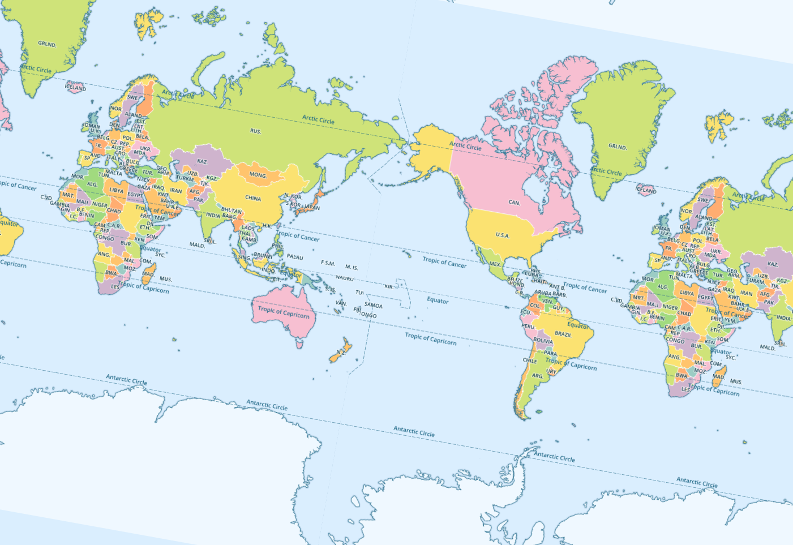

maptalks  Loads .mbtiles tilesets.

inspired by https://gitlab.com/IvanSanchez/Leaflet.TileLayer.MBTiles



[demo](https://deyihu.github.io/src/maptalks-MBTileLayer/examples/)

```js
 var map = new maptalks.Map('map', {
     zoomControl: true,
     center: [0, 0],
     zoom: 0,
 });
 var baseLayer = new maptalks.MBTileLayer('base', {
     // urlTemplate: './countries-raster.mbtiles',
     dbUrl: './countries-raster.mbtiles',
     attribution: '&copy; MapBox Maps',
     debug: true,
     repeatWorld: false,
 });

 baseLayer.on('dataload', e => {
     baseLayer.addTo(map);
 })
```
